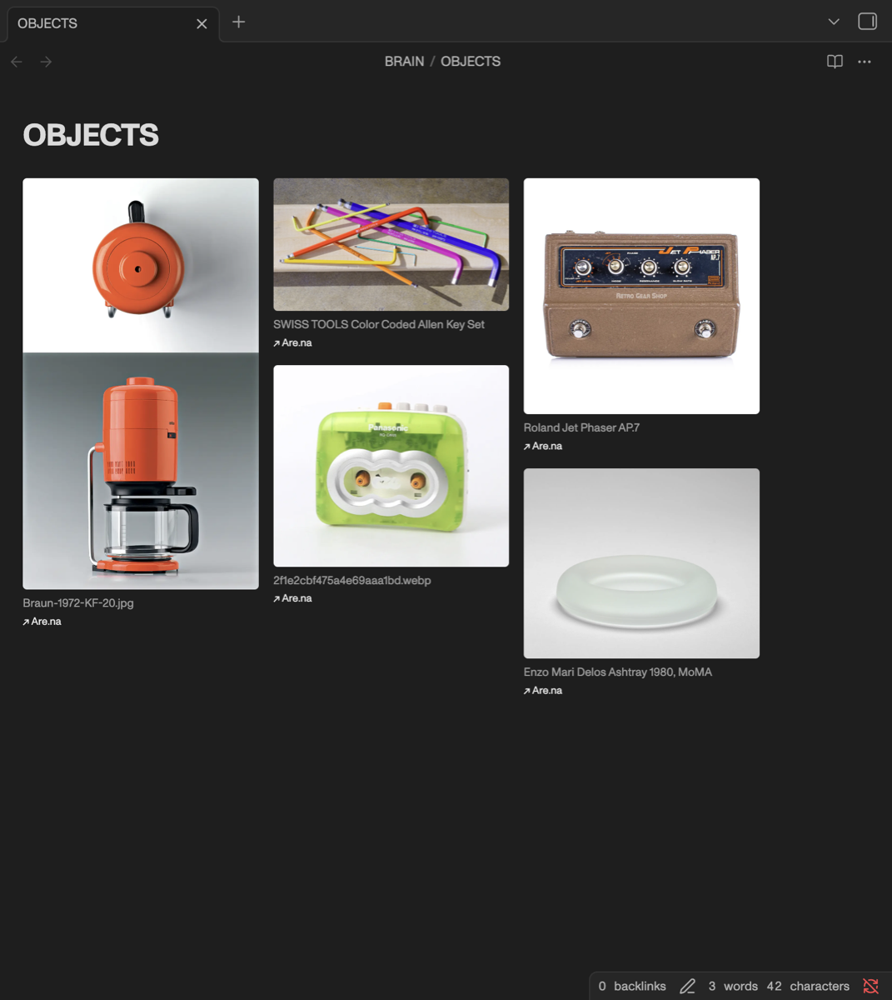

# Are.na Channels

Render [Are.na](https://www.are.na) channels as live, responsive masonry grids inside your Obsidian notes — with a single code block. No file generation, no CSS snippets, works in both Reading view and Live Preview.

> **Unofficial.** This plugin is an independent community project. It is not affiliated with, endorsed by, or supported by Are.na. It uses the public Are.na API.



## Usage

Add a code block to any note:

````markdown
```arena
channel: arena-influences
```
````

That's it. The channel renders as a masonry grid that adapts its column count to the note width.

You can paste a full URL instead of a slug — it's extracted automatically:

````markdown
```arena
channel: https://www.are.na/charles-broskoski/arena-influences
```
````

### Per-block options

Any global setting can be overridden inside a block:

````markdown
```arena
channel: arena-influences
columns: 300
gap: 20
variant: large
caption: true
link: false
fullwidth: false
```
````

| Key         | Values                                   | Default          |
| ----------- | ---------------------------------------- | ---------------- |
| `channel`   | slug or Are.na URL (required)            | —                |
| `columns`   | target column width in px                | 240              |
| `gap`       | space between items in px                | 14               |
| `variant`   | `small` / `medium` / `large` / `original`| medium           |
| `caption`   | `true` / `false`                         | on               |
| `link`      | `true` / `false`                         | on               |
| `fullwidth` | `true` / `false`                         | on               |

## Settings

- **Access token** — a Personal Access Token from
  [are.na/settings/personal-access-tokens](https://www.are.na/settings/personal-access-tokens).
  Required only for private channels; public channels work without one.
- **Grid** — default column width, gap, image quality, titles, and Are.na links.
- **Full width** — notes containing an Are.na grid use the full pane width,
  ignoring "Readable line length". No CSS snippet or `cssclasses` frontmatter
  needed; disable globally or per block with `fullwidth: false`.
- **Cache duration** — how long fetched data is reused before refetching.
  Run **Refresh Are.na grids** from the command palette to force an update.

## Install

### From the community store

Settings → Community plugins → Browse → search "Are.na Channels".

### Manual

1. Download `main.js`, `manifest.json`, and `styles.css` from the latest
   [release](../../releases).
2. Copy them into `<vault>/.obsidian/plugins/arena-channels/`.
3. Reload Obsidian and enable the plugin under Community plugins.

## Development

```bash
npm install
npm run dev      # watch build
npm run build    # production build + typecheck
```

## License

MIT
